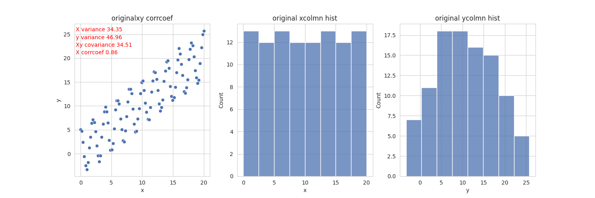
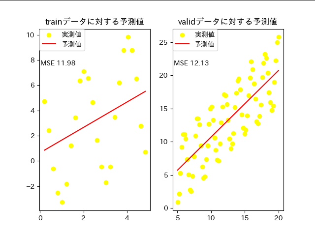
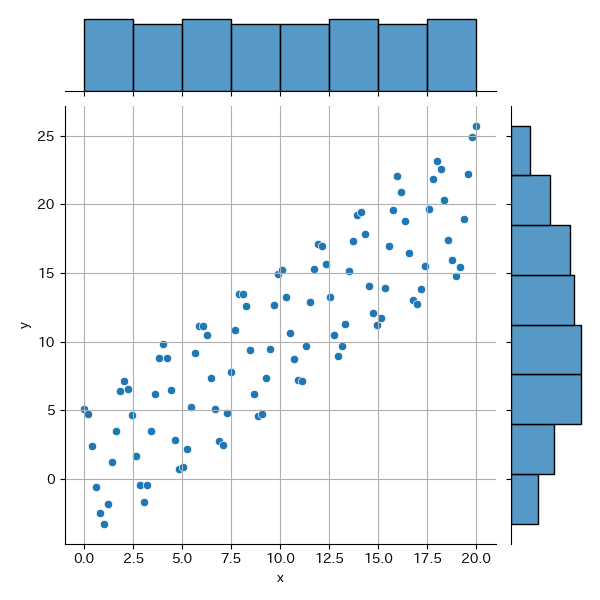
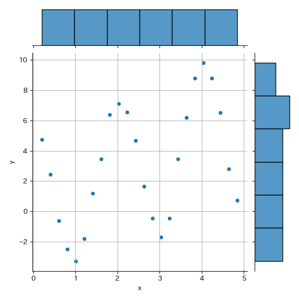
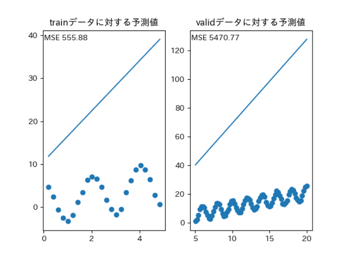
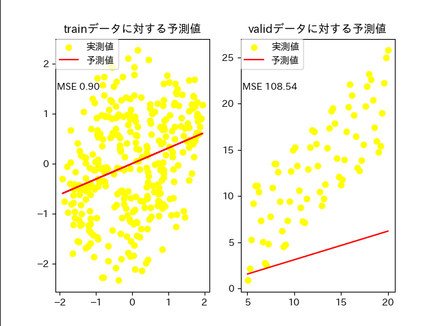
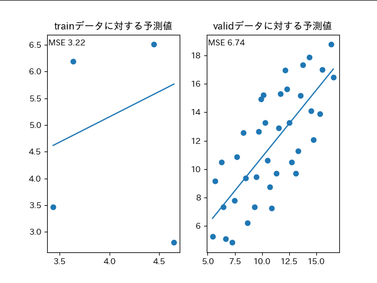
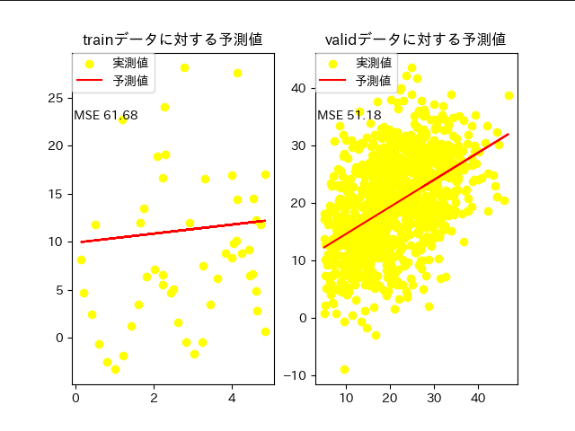
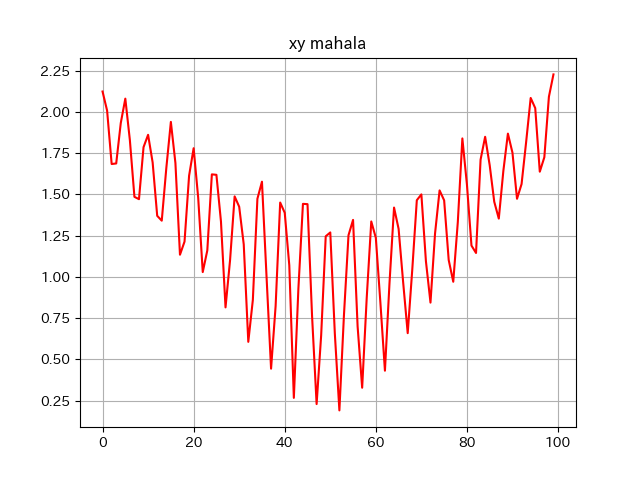

### 問題点1(学習データの相関係数が低い)  
元データのxとyの相関係数 0.8592561749956055  
 
学習データのxとyの相関係数 0.40971243726579526  

検証データのxとyの相関係数 0.7907599587880323  

### 問題点2(学習データが少ない)
```
df_train = df.filter((pl.col("x") > 0) & (pl.col("x") < 5))
# print(df_train.shape) (24, 2)
df_vali = df.filter(pl.col('x') >= 5)
# print(df_vali.shape) (75, 2) 
```

### 評価
#### 前処理なし(元データ)   
ベストパラメータ {'solver': 'svd', 'max_iter': 2000, 'alpha': 5.0}  
ベストスコア 0.10533022616996165  
  
  
**ペアプロット**  
 
 
 
#### 前処理あり  
**Xのみ標準化**  
ベストパラメータ {'solver': 'svd', 'max_iter': 1000, 'alpha': 0.1}  
ベストスコア 0.10532625838858782   
平均二乗誤差 5470.768252040162  


**Xとyの標準化**  
ベストパラメータ {'solver': 'svd', 'max_iter': 1000, 'alpha': 0.1}  
ベストスコア 0.10532625838858785  


**マハラノビス距離が1.3以上のデータを排除**


**ノイズを1000個追加した時**


マハラノビス距離  
 

**ノイズを500個追加、マハラノビス距離ではずれ値を除去、Xとyを標準化**
