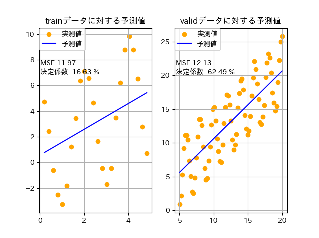

## 問題点1(学習データの相関係数が低い)  
元データのxとyの相関係数 0.8592561749956055  
 
学習データのxとyの相関係数 0.40971243726579526  

検証データのxとyの相関係数 0.7907599587880323  

## 問題点2(学習データが少ない)
```
df_train = df.filter((pl.col("x") > 0) & (pl.col("x") < 5))
# print(df_train.shape) (24, 2)
df_vali = df.filter(pl.col('x') >= 5)
# print(df_vali.shape) (75, 2) 
```

## 評価
### 学習データに前処理前    
#### モデル
```
Ridge回帰  
    -------trainデータに対する予測-------  
    全変動平方和: 344.6729785444128   
    回帰変動平方和: 47.25383917662981   
    残差変動平方和: 287.3509898510406   
    決定係数: 16.630833358462993 %  
    平均二乗誤差: 11.972957910460025  
    -------validデータに対する予測-------  
    全変動平方和: 2424.5721406761804   
    回帰変動平方和: 1444.4860878265144   
    残差変動平方和: 909.5161778199514   
    決定係数: 62.48755965799806 %   
    平均二乗誤差: 12.126882370932686  
``` 

***


**ペアプロット**  
***
  
  
  
### 学習データに前処理後     

データの水増し、マハラノビス距離ではずれ値を除外、標準化  
#### モデル  
    
    ```
    Ridge回帰   

    -------trainデータに対する予測-------    
    全変動平方和: 333.0   
    回帰変動平方和: 31.96608631499504   
    残差変動平方和: 301.031993799941   
    決定係数: 9.600001861879582 %   
    平均二乗誤差: 0.9039999813812042  
    -------validデータに対する予測-------  
    全変動平方和: 2424.5721406761804   
    回帰変動平方和: 6629.990441450026   
    残差変動平方和: 8140.7180787350535   
    決定係数: -235.75895483418026 %   
    平均二乗誤差: 108.54290771646738    

    ```
    
