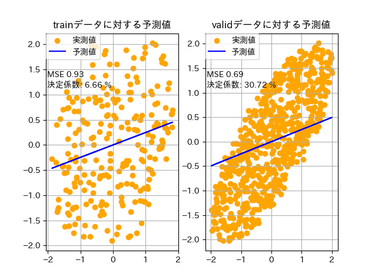
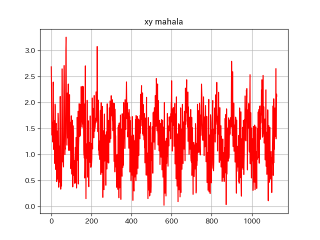

## 問題点1(学習データの相関係数が低い)  
元データのxとyの相関係数 0.8592561749956055  
 
学習データのxとyの相関係数 0.40971243726579526  

検証データのxとyの相関係数 0.7907599587880323  

## 問題点2(学習データが少ない)
```
df_train = df.filter((pl.col("x") > 0) & (pl.col("x") < 5))
# print(df_train.shape) (24, 2)
df_vali = df.filter(pl.col('x') >= 5)
# print(df_vali.shape) (75, 2) 
```

## 評価
### 前処理なし(元データ)   
***
  
  
**ペアプロット**  
***
  
  
  
### 前処理あり 
***
**Xのみ標準化**  
***


**Xとyの標準化**  
***


**マハラノビス距離が1.3以上のデータを排除** 
*** 


**ノイズを1000個追加した時**  
***


**マハラノビス距離**  
***
 

**ノイズを500個追加、マハラノビス距離ではずれ値(マハラノビス距離が2以上をはずれ値とする)を除去、Xとyを標準化**  
***
